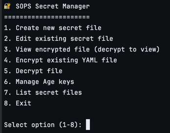
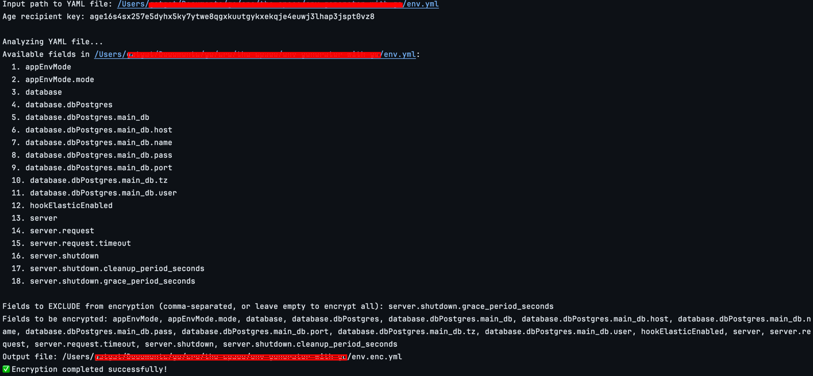

# 🔐 SOPS Secret Manager

A command-line tool for managing encrypted YAML configuration files using Age encryption. This tool provides an interactive interface for creating, editing, encrypting, and decrypting secret files with selective field encryption.

## Features

- 🔐 **Selective Field Encryption**: Choose which fields to encrypt while keeping others in plain text
- 📝 **Interactive Management**: User-friendly CLI interface for all operations
- 🔑 **Age Key Management**: Generate and manage Age encryption key pairs
- 📁 **File Discovery**: Automatically scan and list secret files in your project
- 🔄 **Flexible Operations**: Create, edit, encrypt, decrypt, and view secret files
- 🛡️ **Secure**: Uses Age encryption with X25519 keys for robust security

## Prerequisites

- Go 1.19 or later
- Age encryption tool

## Installation

### 1. Install Age

Run the installation script:

```bash
curl -sSL https://raw.githubusercontent.com/yourusername/sops-cli/main/install-age.sh | bash
```

Or install manually:

**macOS (using Homebrew):**
```bash
brew install age
```

**Ubuntu/Debian:**
```bash
sudo apt update
sudo apt install age
```

**CentOS/RHEL/Fedora:**
```bash
# For newer versions with dnf
sudo dnf install age

# For older versions with yum
sudo yum install age
```

**From source:**
```bash
go install filippo.io/age/cmd/...@latest
```

### 2. Install SOPS CLI

```bash
# Clone the repository
git clone https://github.com/fikrgat/sops_cli_generator.git
cd sops-cli

# Build the application
go build -o sopscli main.go

# Make it executable and move to PATH (optional)
chmod +x sopscli
sudo mv sopscli /usr/local/bin/
```

### 3. Generate Age Key

```bash
age-keygen -y new-age-key.txt
```

#### Output:
```
# created: 2025-05-28T23:10:26+07:00
# public key: XXXXXXXXXXXXXXX  (Public key (recipient))  
AGE-SECRET-KEY-XXXXXXXXX  (Private key (identity))
```

## Quick Start

1. **Run the application:**
   ```bash
   ./sopscli
   ```

2. **Generate Age keys (first time setup):**
    - Select option `6` (Manage Age keys)
    - Choose `1` (Generate new key pair)
    - Keys will be saved to `age-keys.txt`

3. **Create your first secret file:**
    - Select option `1` (Create new secret file)
    - Enter filename (e.g., `secrets.yaml`)
    - Add key-value pairs for your secrets

4. **Encrypt the file:**
    - Select option `4` (Encrypt existing YAML file)
    - Choose which fields to encrypt
    - File will be saved with `.enc` extension

## Usage Guide

### Main Menu Options


### Creating Secret Files

1. Choose option `1` from the main menu
2. Enter a filename (e.g., `database.yaml`)
3. Add key-value pairs:
   ```
   Enter key: database_host
   Enter value: localhost
   
   Enter key: database_password
   Enter value: super_secret_password
   
   Enter key: (leave empty to finish)
   ```

### Selective Field Encryption

When encrypting a YAML file, you can choose which fields to keep in plain text:

```yaml
# Original file (database.yaml)
database_host: localhost
database_port: 5432
database_user: myapp
database_password: super_secret_password
api_key: sk-1234567890abcdef
debug_mode: true
```

After encryption with exclusions (`database_host,database_port,debug_mode`):

```yaml
# Encrypted file (database.enc.yaml)
database_host: localhost          # Plain text
database_port: 5432              # Plain text
database_user: ENC[base64...]    # Encrypted
database_password: ENC[base64...]  # Encrypted
api_key: ENC[base64...]          # Encrypted
debug_mode: true                 # Plain text
```

### Key Management

The tool automatically manages Age keys through the `age-keys.txt` file:

```
# Private key (identity)
AGE-SECRET-KEY-1XXXXXXXXXXXXXXXXXXXXXXXXXXXXXXXXXXXXXXXXXX

# Public key (recipient)  
age1XXXXXXXXXXXXXXXXXXXXXXXXXXXXXXXXXXXXXXXXXXXXXXXXXX
```

### File Listing

Option `7` provides detailed information about your secret files:

```
📁 Secret Files
==================================================
Found 3 YAML file(s):

1. database.enc.yaml
   📍 Path: ./config/database.enc.yaml
   📊 Size: 1.2 KB
   📅 Modified: 2024-12-03 14:30:25
   🔐 Encrypted

2. app-config.yaml
   📍 Path: ./config/app-config.yaml
   📊 Size: 856 B
   📅 Modified: 2024-12-03 12:15:10
   🔓 Plain
   🔑 Fields: app_name, version, features.auth, features.logging

--------------------------------------------------
📈 Summary: 1 encrypted, 1 plain text
⚠️  Warning: 1 unencrypted secret file(s) found!
```

### Encrypt existing YAML file

Option `4` provides encrypt existing YAML file about your secret files:



## File Formats

### Input YAML
```yaml
database:
  host: localhost
  port: 5432
  credentials:
    username: admin
    password: secret123
api:
  key: abc123
  timeout: 30
```

### Encrypted Output
```yaml
database:
  host: localhost
  port: 5432
  credentials:
    username: ENC[YWdlLWVuY3J5cHRpb24ub3JnL3YxCi0+IFgyNTUxOSB...]
    password: ENC[YWdlLWVuY3J5cHRpb24ub3JnL3YxCi0+IFgyNTUxOSB...]
api:
  key: ENC[YWdlLWVuY3J5cHRpb24ub3JnL3YxCi0+IFgyNTUxOSB...]
  timeout: 30
```

## Security Considerations

- 🔑 **Key Storage**: Keep your `age-keys.txt` file secure and never commit it to version control
- 🔒 **Access Control**: Ensure proper file permissions on key files (`chmod 600 age-keys.txt`)
- 🔄 **Key Rotation**: Regularly rotate your Age keys for enhanced security
- 📝 **Audit Trail**: Monitor access to encrypted files in production environments
- 🚫 **Plain Text**: Be cautious about which fields you leave unencrypted

## Troubleshooting

### Common Issues

**Error: "Identity key cannot be empty"**
- Solution: Generate Age keys first using option 6, or manually specify the key

**Error: "Failed to parse YAML"**
- Solution: Ensure your YAML file is properly formatted and valid

**Error: "File does not exist"**
- Solution: Check the file path and ensure the file exists

**Error: "Failed to decrypt"**
- Solution: Verify you're using the correct identity key that matches the recipient key used for encryption

### Debug Mode

For troubleshooting, you can add debug output by modifying the code or using verbose logging.

## Dependencies

- `filippo.io/age` - Age encryption library
- `github.com/spf13/cobra` - CLI framework
- `github.com/spf13/viper` - Configuration management
- `gopkg.in/yaml.v3` - YAML processing

## Contributing

1. Fork the repository
2. Create a feature branch (`git checkout -b feature/amazing-feature`)
3. Commit your changes (`git commit -m 'Add some amazing feature'`)
4. Push to the branch (`git push origin feature/amazing-feature`)
5. Open a Pull Request

## Roadmap

- [ ] Configuration file support
- [ ] Multiple recipient support
- [ ] Integration with cloud key management services
- [ ] Backup and restore functionality
- [ ] Web interface
- [ ] Docker container support

## Support

If you encounter any issues or have questions:

1. Check the [Troubleshooting](#troubleshooting) section
2. Search existing [GitHub Issues](https://github.com/fikrgat/sops_cli_generator/issues)
3. Create a new issue with detailed information about your problem

---

**Made with ❤️ for secure configuration management**